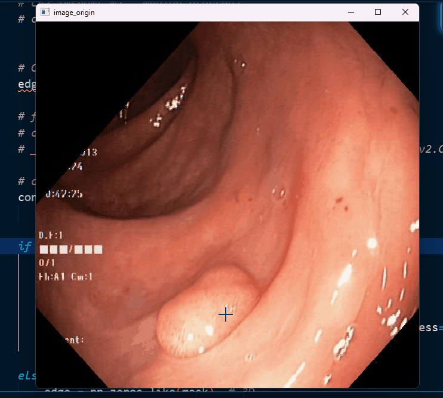

Here is a README file based on the information you've provided:

---

# Image Selector Python Tool

This project is a Python-based tool designed to allow users to interactively select regions within images using OpenCV and Numpy. The tool supports user input for region selection, edge detection, and object removal, and utilizes GrabCut for fine-tuning mask generation.

## Features
- **Interactive region selection**: Click and drag to define regions of interest.
- **Edge detection**: The tool includes a feature to detect edges of objects within the selected region.
- **Region refinement**: Utilizes the GrabCut algorithm to clean up selected areas, providing more accurate results.
- **Edge visualization**: Detected edges can be saved and displayed in different colors.
- **Image manipulation**: Supports various image processing functionalities such as resizing, masking, and applying margins to regions.

## Demo
A demo GIF, `demo_gif.gif`, is provided in the repository. This GIF shows the program in action, illustrating how regions are selected and processed within the tool.

Here is a demonstration of the tool in action:



## Usage
1. **Installation**: Ensure you have Python and the necessary libraries installed. Install required dependencies:
   ```bash
   pip install -r requirements.txt
   ```
2. **Running the Tool**: You can run the main script using the command below. The program will open an interactive window where you can select regions and process them.
   ```bash
   python simple_editor_v06.py
   ```

3. **Image Selection**: The program comes with sample images in the `sample_imgs` folder. You can manually load images or let the program randomly pick one from the sample set.

4. **Controls**:
   - **Left-click**: Draw areas to preserve (blue).
   - **Right-click**: Mark areas for removal (red).
   - **Enter**: Apply the GrabCut algorithm to the selected region.
   - **S**: Save the detected edge.
   - **= / -**: Increase or decrease marker size.
   - **R**: Reset all selections.
   - **ESC**: Exit the program.

## File Descriptions
- `demo_gif.gif`: A GIF demonstrating the functionality of the tool.
- `selector.txt`: A text file containing information about the selected regions or settings.
- `simple_editor_v06.py`: The main Python script for running the image selection tool.
- `opencv_test.txt`: Log or notes related to OpenCV testing.
- `README.md`: This file, which provides an overview of the project.

## Example Workflow
1. Load an image from the `sample_imgs` folder.
2. Use your mouse to mark regions you want to preserve (left-click) or remove (right-click).
3. Press **Enter** to apply the GrabCut algorithm to refine the selection.
4. Press **S** to save the detected edges.
5. Adjust the marker size with `+` or `-` for finer control of region selection.
6. Reset selections with `R` and start over if necessary.

## Requirements
- Python 3.x
- OpenCV
- Numpy

Make sure to install all required libraries before running the tool.

---